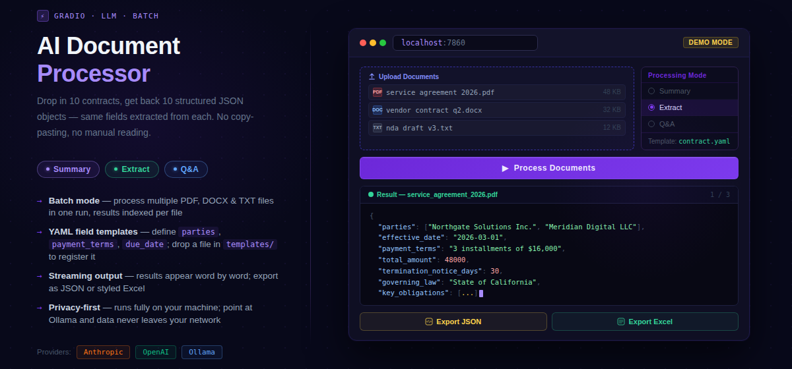

# AI Document Processor



Batch-process PDF, DOCX, and TXT documents through an LLM — extract structured data, generate summaries, or answer questions. Results export to JSON or Excel with one click.

This is a **document automation tool**, not an AI chat interface. The difference matters: you drop in 10 contracts, get back 10 structured JSON objects with the same fields extracted from each. No copy-pasting, no manual reading.

---

## What it does

- **Summary mode** — bullet-point summary of each document
- **Extract mode** — pull specific fields (parties, dates, payment terms, etc.) defined in a YAML template, returned as structured JSON
- **Q&A mode** — ask a question, get an answer grounded in the document text
- **Batch processing** — upload multiple files at once, process them all in sequence
- **Streaming output** — results appear word by word as the model generates them
- **Export** — download all results as a single JSON file or a styled Excel spreadsheet

---

## Why this instead of pasting into ChatGPT

| | This tool | ChatGPT web UI |
|---|---|---|
| Process 20 files at once | yes | no |
| Structured JSON output | yes | unreliable |
| Runs on your machine | yes | no |
| Data leaves your network | never | always |
| Customizable field templates | yes | no |
| Scriptable / automatable | yes | no |

---

## Quick start — no API key needed

Mock mode uses pre-written responses so you can explore the full UI without any API credentials.

```bash
# 1. Clone and install dependencies
git clone <repo-url>
cd python-ai-doc-processor
pip install -r requirements.txt

# 2. Launch (mock mode activates automatically — no .env needed)
python src/app.py
```

Open http://localhost:7860 in your browser. Upload one of the files from `sample_docs/` and click **Process Documents**. A yellow banner at the top confirms you are in demo mode.

---

## Real usage (live AI)

```bash
# 1. Copy the example env file
cp .env.example .env

# 2. Add your API key (Anthropic or OpenAI — one is enough)
# Edit .env:
#   ANTHROPIC_API_KEY=sk-ant-...
#   OPENAI_API_KEY=sk-...

# 3. Run
python src/app.py
```

The app auto-detects which key is present and picks the provider. Anthropic is preferred when both are set.

---

## Using the UI

1. **Upload** one or more PDF, DOCX, or TXT files
2. **Select a mode**: Summary, Extract, or Q&A
3. In Extract mode, choose a **template** (Contract or Report) from the dropdown
4. In Q&A mode, type your **question** in the text box
5. Click **Process Documents** — output streams in real time
6. Click **Export JSON** or **Export Excel** to download results

---

## Templates

Templates live in `templates/` as YAML files. Each defines a list of fields to extract.

**`templates/contract.yaml`** — parties, effective_date, payment_terms, key_obligations, termination_clause

**`templates/report.yaml`** — executive_summary, key_findings, metrics, action_items, risks

### Adding a new template

```yaml
# templates/invoice.yaml
name: invoice
description: Invoice document
fields:
  - name: invoice_number
    description: The unique invoice identifier
  - name: vendor
    description: Name and address of the issuing vendor
  - name: total_amount
    description: Total amount due including taxes
  - name: due_date
    description: Payment due date
```

Drop the file in `templates/` and it appears in the dropdown automatically on next launch.

---

## Project structure

```
python-ai-doc-processor/
├── src/
│   ├── app.py          # Gradio UI
│   ├── processor.py    # Prompt building + LLM API calls + mock mode
│   ├── parsers.py      # PDF / DOCX / TXT text extraction
│   └── exporter.py     # JSON and Excel export
├── templates/
│   ├── contract.yaml
│   └── report.yaml
├── sample_docs/
│   ├── sample_contract.txt
│   └── sample_report.txt
├── mock_responses/     # Pre-written demo responses
├── tests/
│   ├── test_parsers.py
│   └── test_exporter.py
├── requirements.txt
└── .env.example
```

---

## Running tests

```bash
pip install pytest
pytest tests/
```

---

## Extensibility

**Swap the LLM provider** — set `OPENAI_API_KEY` instead of `ANTHROPIC_API_KEY`. The app detects which key is present and routes accordingly. To add a new provider, implement a branch in `processor.call_llm()`.

**Run as a CLI batch script** — `parsers.py`, `processor.py`, and `exporter.py` are plain Python modules with no Gradio dependency. Import them directly to build a headless batch pipeline:

```python
from src.parsers import parse_file
from src.processor import build_prompt, call_llm
from src.exporter import to_excel

results = []
for path in pathlib.Path("inbox/").glob("*.pdf"):
    text = parse_file(str(path))
    prompt = build_prompt(text, mode="extract", template_name="contract")
    result = call_llm(prompt, provider="anthropic")
    results.append({"filename": path.name, "mode": "extract", "result": result})

to_excel(results, "output.xlsx")
```

**Use a local model** — replace the `call_llm` body with an Ollama-compatible call. Ollama exposes an OpenAI-compatible API at `http://localhost:11434/v1`, so you can point the OpenAI client at it with `base_url="http://localhost:11434/v1"` and `api_key="ollama"`. Data never leaves the machine.

---

## Private deployment

The app runs entirely on your local machine. Documents are read from disk, sent to the LLM API you configure, and never stored anywhere else. To keep data fully on-premises, use a local model via Ollama (see above) — in that configuration no data leaves your network at any point.
